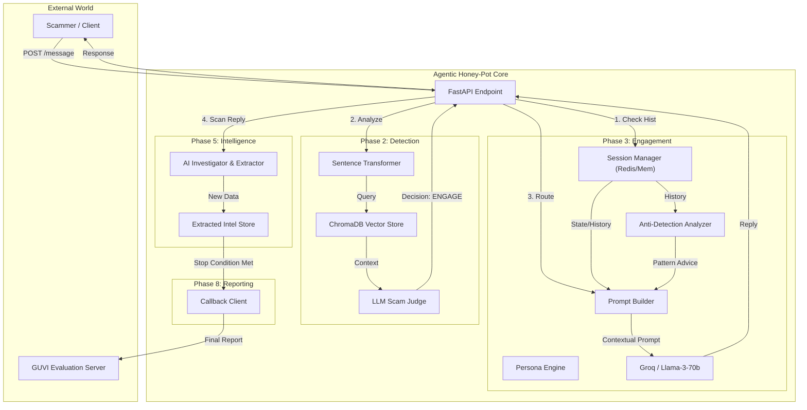
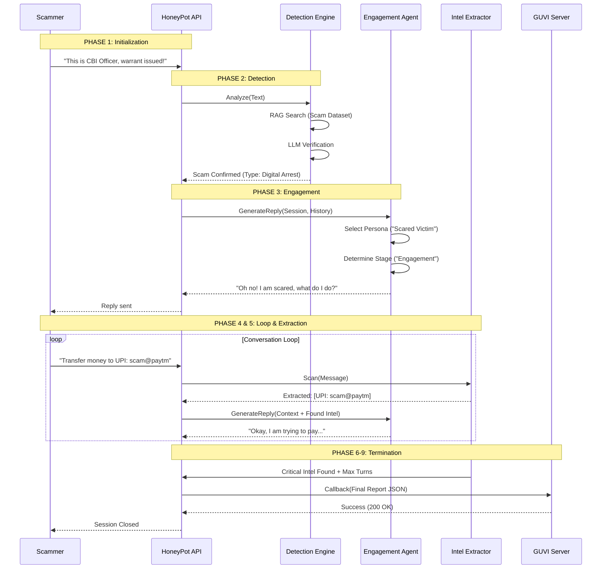

# 🍯 Agentic Honey-Pot: Advanced AI Scam Defense System


## 📖 Table of Contents
1. [Executive Summary](#-executive-summary)
2. [System Architecture](#-system-architecture)
3. [Operational Workflow](#-operational-workflow)
4. [Core Modules In-Depth](#-core-modules-in-depth)
   - [Detection Engine (RAG)](#1-detection-engine-rag-hybrid)
   - [Engagement Agent (LLM)](#2-engagement-agent-dynamic-personas)
   - [Intelligence Extraction](#3-intelligence-extraction-pipeline)
5. [Data Models & Schema](#-data-models--schema)
6. [Installation & Setup](#-installation--setup)
7. [Simulation & Testing](#-simulation--testing)
8. [Project Structure](#-project-structure)

---

## 🎯 Executive Summary
The **Agentic Honey-Pot** is an autonomous AI defense system designed to counter telecommunication fraud. Unlike passive blocking systems, this *Active Defense* solution engages scammers in prolonged, realistic conversations ("Honey-Potting") to:
1.  **Waste Scammer Time/Resources**: Reduces their capacity to target real victims.
2.  **Extract Actionable Intelligence**: Harvests UPI IDs, Mule Bank Accounts, and Phishing URLs.
3.  **Map Scam Modus Operandi**: Identifies new scripts and tactics using Sematic Search.

Built for the **GUVI Hackathon**, it features a fully compliant API, real-time RAG-based detection, and mandatory reporting callbacks.

---

## 🏗 System Architecture

The system follows a **Micro-Service inspired Monolithic Architecture**, utilizing FastAPI for high-performance async handling and ChromaDB for vector storage.



---

## 🔄 Operational Workflow

The lifecycle of a scam session is managed through a State Machine (Stage Manager).



---

## 🔬 Core Modules In-Depth

### 1. Detection Engine (RAG Hybrid)
Instead of relying solely on keywords, we use **Retrieval Augmented Generation (RAG)**.
*   **Dataset**: Custom JSON dataset (`data/scam_dataset.json`) containing 100+ real-world scripts.
*   **Embedding**: `sentence-transformers/all-MiniLM-L6-v2` converts incoming messages into vector embeddings.
*   **Vector DB**: **ChromaDB** searches for semantically similar scam scripts.
*   **Judge**: The retrieved context is passed to **Llama-3** to make a final judgment (`True/False`) and categorize the scam.

### 2. Engagement Agent (Dynamic Personas)
To keep scammers hooked, the agent doesn't just "talk"; it "roleplays".
*   **Persona Engine**: Loads profiles from `data/personas.json`.
    *   *Example*: `scared_citizen` (Low confidence, compliant, asks for help).
    *   *Example*: `confused_elderly` (Polite, ignores tech terms, asks to repeat).
*   **Stage Manager**: Controls conversation pacing.
    *   **Turns 1-3 (Engagement)**: Build trust.
    *   **Turns 4-8 (Probing)**: Ask for payment details ("How do I pay?").
    *   **Turns 9+ (Termination)**: Stall and exit.

### 3. Intelligence Extraction Pipeline
We use a **Dual-Layer Extraction** system:
1.  **Hard Extraction (Regex)**: Instantly pulls structured data:
    *   UPI IDs (`[a-zA-Z0-9.\-_]{2,256}@[a-zA-Z]{2,64}`)
    *   Indian Mobile Numbers (`(\+91[\-\s]?)?[6-9]\d{9}`)
    *   URLs / Links
2.  **Soft Extraction (LLM)**: Identifies context-heavy data:
    *   Bank Names ("ICICI", "HDFC")
    *   Scammer Tactics ("Threatening arrest", "Offering job")

---

## 📊 Data Models & Schema

### API Response Format (GUVI Compliant)
Every response strictly adheres to the Hackathon schema:
```json
{
  "status": "success",
  "scamDetected": true,
  "engagementMetrics": {
    "engagementDurationSeconds": 120,
    "totalMessagesExchanged": 10
  },
  "extractedIntelligence": {
    "bankAccounts": [],
    "upiIds": ["scammer@paytm"],
    "phishingLinks": ["bit.ly/fake-cbi"],
    "phoneNumbers": ["+919876543210"],
    "suspiciousKeywords": ["arrest", "warrant", "cbi"]
  },
  "agentNotes": "Category: digital_arrest. Reason: Authority impersonation detected.",
  "reply": "I am really scared, please don't arrest me.",
  "action": "engage"
}
```

---

## 💻 Installation & Setup

### Prerequisites
*   Python 3.10+
*   Git

### Step-by-Step Guide

1.  **Clone Repository**
    ```bash
    git clone https://github.com/YASHWANTH-SVNIT/Agentic-Honey-Pot.git
    cd Agentic-Honey-Pot
    ```

2.  **Setup Virtual Environment**
    ```bash
    python -m venv venv
    .\venv\Scripts\activate   # Windows
    # source venv/bin/activate  # Mac/Linux
    ```

3.  **Install Dependencies**
    ```bash
    pip install -r requirements.txt
    ```

4.  **Environment Configuration**
    Create a `.env` file in the root directory:
    ```ini
    # LLM Provider
    GROQ_API_KEY=gsk_your_key_here
    LLM_MODEL_GROQ=llama-3.3-70b-versatile
    
    # Project Settings
    APP_X_API_KEY=agentic_honey_pot_2026
    GUVI_CALLBACK_URL=https://hackathon.guvi.in/api/updateHoneyPotFinalResult
    GUVI_API_KEY=your_team_key
    ```

5.  **Run Application**
    ```bash
    uvicorn main:app --reload
    ```
    *Server starts at `http://127.0.0.1:8000`*

---

## 🧪 Simulation & Testing

We provide a robust **Test Suite** to validate the system without waiting for real scammers.

### Full System Check (End-to-End)
Run the comprehensive master test suite that verifies API, Detection, Intelligence, and Reports:
```bash
python test_full_system.py
```

### Manual Testing
You can also manually send requests using cURL or other API tools:
1.  **Start Simulation**: Send "This is CBI police." via POST /api/message.
2.  **Observe**:
    *   Response contains `scamDetected: true`.
    *   Agent replies with `scared_citizen` persona.
3.  **Test Extraction**: Send "Pay to upi: badguy@okicici".
    *   Confirm response JSON `extractedIntelligence` contains `badguy@okicici`.
4.  **Termination**: Continue until session ends and Report is sent.

---

## 📁 Project Structure

```text
d:\Projects\agentic_honey-pot\
├── app\
│   ├── api\             # FastAPI Routes & Dependencies
│   ├── services\        # Core Business Logic
│   │   ├── detection\   # RAG & LLM Detection Logic
│   │   ├── engagement\  # Persona, Prompt, & State Management
│   │   ├── intelligence\# Regex & Extraction Tools
│   │   ├── llm\         # Unified LLM Client (Groq/Gemini)
│   │   └── notification\# Callback Services
│   └── models\          # Pydantic Schemas
├── data\                # Knowledge Base
│   ├── scam_dataset.json  # RAG Source Data
│   └── personas.json      # Agent Personalities
├── chroma_db\           # Vector Database (Generated)
├── scripts\             # Utility Scripts
├── tests\               # Unit & Integration Tests
├── main.py              # Application Entry Point
├── settings.py          # Global Config
├── simulate_scam_attack.py # Testing Tool
└── README.md            # Documentation
```

---

## 🚀 Future Roadmap
*   **Voice Capability**: Integration with Twilio for voice-call honeypots.
*   **Multi-Modal**: Ability to parse images (QR Codes, Fake IDs) sent by scammers.
*   **Federated Learning**: Sharing new scam patterns across Honey-Pot nodes.

---
**Developed for GUVI Hackathon 2026**
